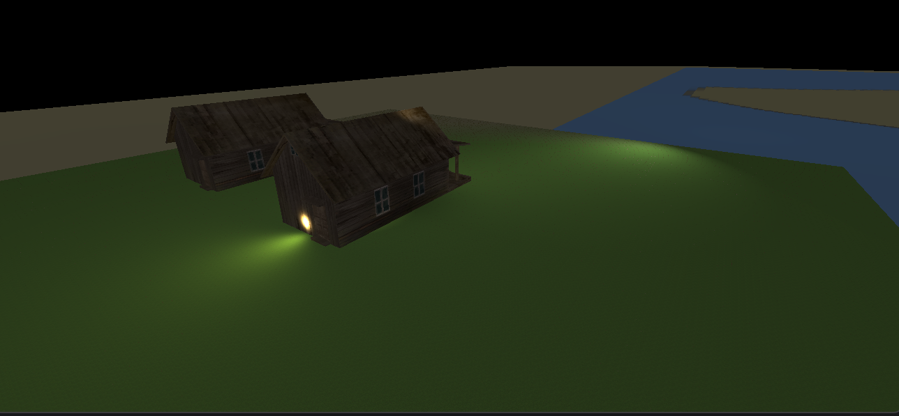

# Nucleus Engine
### Lightweight 3D Game Engine built with LWJGL

**Nucleus** is a lightweight, modular **3D game engine** written in **Java** using  
**LWJGL 3 (Lightweight Java Game Library)**.

The engine focuses on performance, clean architecture, and flexibility, while
providing essential modern 3D features such as dynamic lighting, terrain blending,
and model loading.

---

## ✨ Features

### 💡 Lighting System
- Directional Light (sun-like lighting)
- Point Light (omni-directional)
- Spot Light (cone-based lighting)
- Real-time dynamic lighting
- Adjustable color & intensity

### 🏔️ Terrain & Textures
- BlendMap support for multi-textured terrain
- Optimized terrain rendering

### 📦 3D Model Support
- OBJ model loading with textures
- Easy custom model integration

### 🎮 Input & Camera
- Keyboard input
- Mouse-controlled camera rotation
- Adjustable movement speed & sensitivity

---

## 🚀 Getting Started



### Prerequisites
- Java 11 or newer
- Maven
- OpenGL compatible GPU

###  To learn LWJGL:
- https://www.youtube.com/watch?v=XfjmLP_PSsQ&list=PL4QbKfRYvHvSJSVgHawYIvcIA0CcgnMzw I inspired from this video series. 
- https://www.lwjgl.org/ 

### Build & Run
```bash
mvn clean compile exec:java

